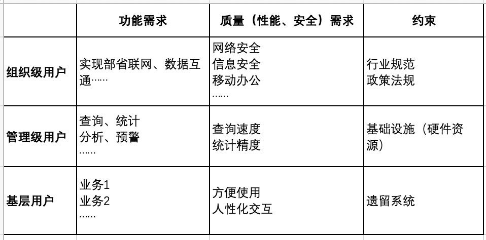
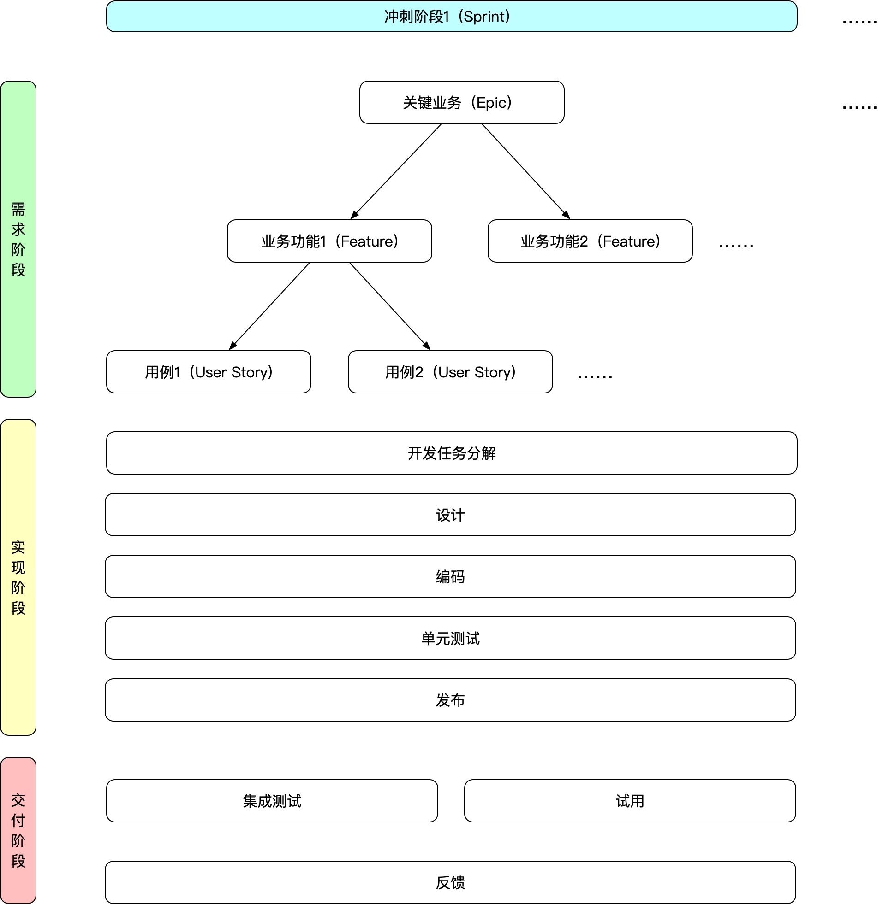

<!-- # 需求阶段工作内容 -->

## 概述

- 需求采集——挖掘需求
- 需求分析——业务建模
- 需求分解——规格化（可执行、可跟踪、可验证）

## 需求采集

### 方法论

- 场景卡
- 原型法

### 指南

- 需求背后的动机，比需求本身更有意义
- 了解行业及其参与者、明确概念（专有名词）、清楚目标用户组织架构与协作关系、掌握核心业务场景
- 走到用户身边，全方位、多角度挖掘需求、搞清楚动机，可使用需求正交表，易归类、不遗漏

### 交付

- 行业介绍、重要的行业规范
- 目标用户组织架构及角色说明
- 关键业务场景列表
- 约束分析、现状分析

## 需求分析

### 方法论

- 泳道图（Swimlane Diagram），多维度分析业务流程
- 业务（领域）建模（概念 + 业务网络）

### 指南

- MIS 思维 vs. biz 思维
- 重视概念及专有名词，提高沟通效率
- 项目参与人员的共识很重要

### 交付

- 关键业务流程图（泳道图）及说明
- 与开发经理（或开发人员）沟通目前掌握的所有材料

## 需求分解

### 方法论

- 识别关键业务（需求），排列优先级，并对其细化分解

### 指南

- 需求阶段也是可迭代的，关键业务（需求）可作为迭代的最小单元
- 关键业务（需求）——功能清单——用例

### 交付

- 阶段性任务清单（Backlog），可指导工作任务分解、测试用例编制

## 关于 Scrum

- 工期不可控——螺旋迭代；质量不可控——持续交付
- 动态冲刺周期（根据 Epic 大小、可交付的内容、开发节奏调整，初期 2 周，中后期 1 周，建议最长不超过 2 周）
- 工具：跟踪（看板？）、文档协作、开发（Git）
- 立会（Standup）：显性的自我回顾、自我规划（对自己很重要，团队中的其他人可能也感兴趣），以及展示问题。频率——每日；各自发言即结束（有问题会后交流）。
- 角色（去中心化）：现场客户——Involvement；产品负责人（Project Owner）、Scrum 主管（Scrum Master）、开发成员——Commitment
